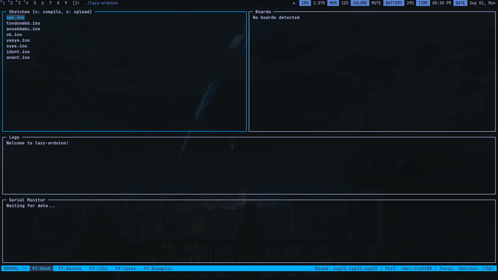
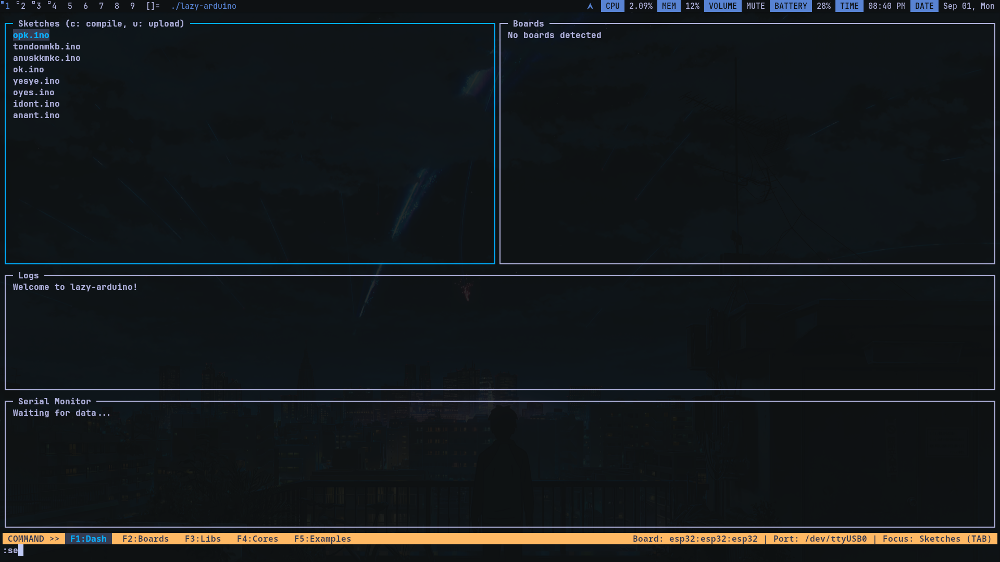
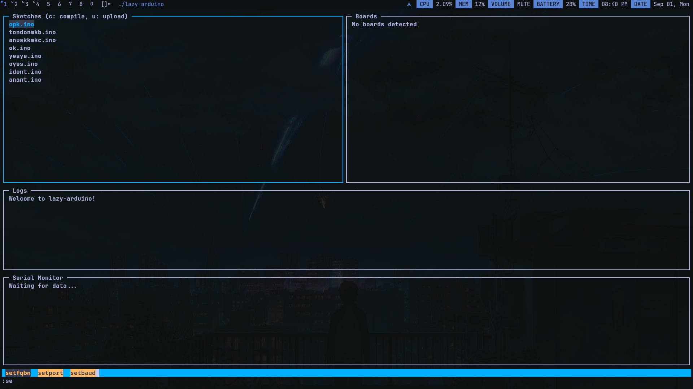
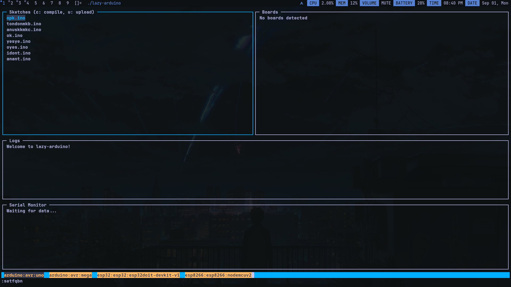
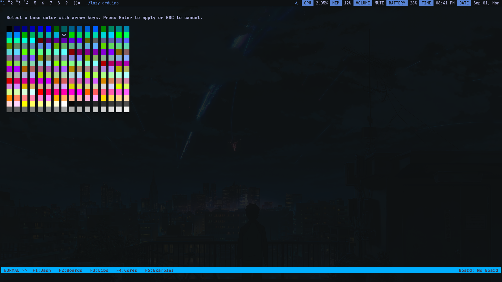

# Lazy Arduino

<table>
  <tr>
    <td width="120">
      
    </td>
    <td>
      <h1>Lazy Arduino</h1>
    </td>
  </tr>
</table>

**Lazy Arduino** is a lightweight, terminal-based user interface (TUI) for the `arduino-cli`. It provides a user-friendly way to manage Arduino projects, boards, and libraries directly from the command line, making it ideal for developers who work over SSH or on resource-constrained systems.







## Features

- **TUI Interface:** A clean and intuitive ncurses-based interface.
- **Sketch Management:** List, create, and edit `.ino` sketches.
- **Board Management:** Detect and list connected Arduino boards.
- **Compilation and Uploading:** Compile and upload sketches to your target board.
- **Command Mode:** An interactive command mode for advanced operations.
- **Auto-completion:** Tab-completion for commands and arguments.
- **Theming:** Customize the look and feel of the application with themes and colors.
- **Configuration:** Persistent configuration for your target board and port.

## Code Structure

The project is organized into several modules, each with a specific responsibility. Here's a breakdown of the key modules and their roles:

### Core Modules

- **`main.c`**: The entry point of the application. It initializes the UI, manages the main event loop, and handles user input.
- **`ui.c` / `ui.h`**: Manages the ncurses UI, including window creation, resizing, and color themes.
- **`state.c` / `state.h`**: Defines the application's state, including the current mode (normal, command, completion), focused panel, and command buffer.
- **`pages.c` / `pages.h`**: Manages the different pages of the application (e.g., Dashboard, Color Picker). It uses a registry of `Page` structs to define the behavior of each page.
- **`panel.h`**: Defines the `Panel` struct, which represents a rectangular section of the UI with a title and content.

### Functionality Modules

- **`arduino.c` / `arduino.h`**: Provides functions for interacting with `arduino-cli`, such as compiling and uploading sketches.
- **`sketches.c` / `sketches.h`**: Manages Arduino sketches, including loading, displaying, and opening them in an editor.
- **`board.c` / `board.h`**: Handles the detection and listing of connected Arduino boards.
- **`command.c` / `command.h`**: Implements the command processing system, including a registry of available commands.
- **`completion.c` / `completion.h`**: Provides the auto-completion logic for commands and their arguments.
- **`config.c` / `config.h`**: Manages the loading and saving of the application's configuration.
- **`logs.c` / `logs.h`**: Provides a logging facility for displaying messages to the user.
- **`serial.c` / `serial.h`**: (In progress) Intended for serial monitor functionality.
- **`colors.c` / `colors.h`**: Provides functions for color manipulation and theming.
- **`color_picker.c` / `color_picker.h`**: Implements the color picker page.
- **`status.c` / `status.h`**: Manages the status bar at the bottom of the screen.

### Execution Flow

1.  **Initialization:** `main.c` calls `init_ui()` to set up the ncurses environment and `load_config()` to load the user's settings.
2.  **Main Loop:** The application enters a `while` loop in `main.c` that waits for user input.
3.  **Input Handling:**
    - In **Normal Mode**, input is passed to the current page's input handler (`handle_current_page_input()`).
    - Pressing `:` switches to **Command Mode**.
    - In **Command Mode**, user input is captured in the command buffer. Pressing `Enter` executes the command using `process_command()`.
    - Pressing `Tab` in **Command Mode** triggers **Completion Mode**.
4.  **Drawing:** On each iteration of the main loop, `draw_current_page()` is called to render the UI for the active page. This, in turn, calls the `draw_func` for each panel on the page.
5.  **Termination:** Pressing `q` in **Normal Mode** exits the application, calling `end_ui()` to clean up the ncurses environment.

## Build and Run

To build and run the project, you'll need `ncurses` and `arduino-cli` installed.

1.  **Clone the repository:**
    ```bash
    git clone https://github.com/your-username/lazy-arduino.git
    cd lazy-arduino
    ```
2.  **Build the project:**
    ```bash
    make
    ```
3.  **Run the application:**
    ```bash
    ./lazy-arduino
    ```

## Usage

### Navigation

- **`F1` - `F6`**: Switch between different pages.
- **`Tab`**: Cycle through the panels on the current page.
- **Arrow Keys (`Up`/`Down` or `k`/`j`)**: Navigate within a panel.
- **`q`**: Quit the application.

### Commands

To enter command mode, press `:`. Here are some of the available commands:

- **`:newfile <filename>`**: Create a new `.ino` file.
- **`:color <#RRGGBB>`**: Set the theme color using a hex code.
- **`:setfqbn <fqbn>`**: Set the fully qualified board name (e.g., `arduino:avr:uno`).
- **`:setport <port>`**: Set the serial port (e.g., `/dev/ttyUSB0`).
- **`:setbaud <rate>`**: Set the baud rate for the serial monitor.

### Configuration

The application stores its configuration in `~/.lazyduino/config.ini`. This file is created automatically and can be edited manually. The following settings are available:

- **`TARGET_FQBN`**: The default FQBN for compiling and uploading.
- **`TARGET_PORT`**: The default serial port.
- **`TARGET_BAUD`**: The default baud rate.